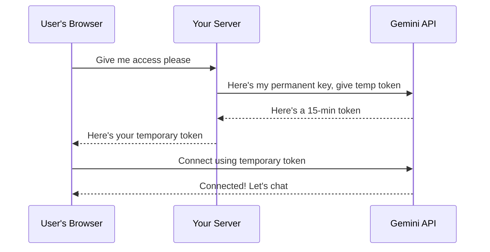

## 🔐 What Are Ephemeral Tokens?

Imagine you're building a web app that needs to use an AI API like Gemini or OpenAI. Your app runs in the browser, so if you put your API key directly in the code, anyone can steal it. That's a big problem!

**Ephemeral tokens** solve this. They're like temporary passwords that expire automatically after a few minutes. Think of them as visitor passes at an office—they work for a short time and then become useless.

<div className="flex justify-center my-6">
  
</div>

## 🤔 The Problem They Solve

### Without Ephemeral Tokens
```
Your App → Uses Permanent API Key → Anyone can steal it! 😱
```

If someone steals your permanent API key:
- They can use your API credits
- You have to revoke the key and update your entire app
- All your users get affected

### With Ephemeral Tokens
```
Your App → Uses Temporary Token → Expires in 15 mins → Much safer! ✅
```

If someone steals the token, it becomes useless within minutes. Your permanent key stays safe on your server.


## ⚙️ How It Works (Simple Version)

Here's the complete flow in 5 steps:

1. **User opens your app** → App asks your backend for a token
2. **Your backend** → Uses your permanent API key to request a temporary token
3. **API provider** → Sends back an ephemeral token (valid for 15 minutes)
4. **Your backend** → Forwards the token to your app
5. **Your app** → Uses this temporary token to connect to the API



## 💻 Implementation Example

Here's a practical example showing how to implement ephemeral token authentication:

### Backend Implementation (Node.js/Express)

```javascript
// backend/routes/auth.js
import express from 'express';
import fetch from 'node-fetch';

const router = express.Router();

router.post('/get-token', async (req, res) => {
  try {
    // Your permanent API key stored securely in environment variables
    const API_KEY = process.env.GEMINI_API_KEY;
    
    // Request ephemeral token from Gemini
    const response = await fetch('https://api.gemini.com/v1/auth/ephemeral', {
      method: 'POST',
      headers: {
        'Authorization': `Bearer ${API_KEY}`,
        'Content-Type': 'application/json'
      },
      body: JSON.stringify({
        ttl: 900 // Token valid for 15 minutes (900 seconds)
      })
    });
    
    const data = await response.json();
    
    // Send ephemeral token to client
    res.json({
      token: data.ephemeralToken,
      expiresAt: data.expiresAt
    });
  } catch (error) {
    console.error('Token generation failed:', error);
    res.status(500).json({ error: 'Failed to generate token' });
  }
});

export default router;
```

### Frontend Implementation (React)

```javascript
// frontend/services/geminiService.js
class GeminiService {
  constructor() {
    this.token = null;
    this.expiresAt = null;
    this.ws = null;
  }
  
  async getEphemeralToken() {
    // Request token from your backend
    const response = await fetch('https://your-backend.com/api/get-token', {
      method: 'POST',
      headers: {
        'Content-Type': 'application/json',
        // Include user's session token if using authentication
        'Authorization': `Bearer ${userSessionToken}`
      }
    });
    
    const data = await response.json();
    this.token = data.token;
    this.expiresAt = new Date(data.expiresAt);
    
    return this.token;
  }
  
  async connect() {
    // Check if token is still valid
    if (!this.token || new Date() >= this.expiresAt) {
      await this.getEphemeralToken();
    }
    
    // Establish WebSocket connection using ephemeral token
    this.ws = new WebSocket(`wss://api.gemini.com/v1/ws?token=${this.token}`);
    
    this.ws.onopen = () => {
      console.log('Connected to Gemini API');
    };
    
    this.ws.onmessage = (event) => {
      const response = JSON.parse(event.data);
      // Handle AI responses
      console.log('Received:', response);
    };
    
    this.ws.onerror = (error) => {
      console.error('WebSocket error:', error);
    };
    
    this.ws.onclose = () => {
      console.log('Disconnected from Gemini API');
    };
  }
  
  sendMessage(message) {
    if (this.ws?.readyState === WebSocket.OPEN) {
      this.ws.send(JSON.stringify({ message }));
    }
  }
  
  disconnect() {
    if (this.ws) {
      this.ws.close();
    }
  }
}

export default new GeminiService();
```

---

## ✅ Key Benefits

| Benefit | What It Means |
|---------|---------------|
| 🔒 **Secure** | Your permanent key never leaves your server |
| ⏰ **Auto-Expire** | Stolen tokens become useless in minutes |
| 🚀 **Faster** | Direct connection from browser to API |
| 👥 **User-Specific** | Each user gets their own token |
| 🔧 **Easy to Revoke** | Cancel one token without affecting others |

---

## 🎯 Best Practises (Keep It Simple)

### 1. Keep Tokens Short-Lived
```javascript
// Good: Token expires in 15 minutes
ttl: 900 

// Bad: Token lasts for days
ttl: 86400
```

### 2. Always Use HTTPS
```javascript
// Good ✅
const ws = new WebSocket('wss://api.gemini.com');

// Bad ❌ (insecure)
const ws = new WebSocket('ws://api.gemini.com');
```

### 3. Refresh Before Expiry
```javascript
// Check if token is about to expire
if (Date.now() >= expiryTime - 60000) { // 1 min before
  token = await getNewToken(); // Get fresh token
}
```

## 📊 Comparison with Other Methods

| Method | Lifespan | Safe for Browser? | Best For |
|--------|----------|-------------------|----------|
| **Permanent API Key** | Forever | ❌ Never! | Server-to-server only |
| **OAuth Token** | Days/Weeks | ⚠️ Somewhat | User login systems |
| **Ephemeral Token** | Minutes | ✅ Yes! | Browser/Mobile apps |

---

## 🌟 Real-World Examples

**AI Chat Apps**: Use ephemeral tokens to let users chat with AI directly from their browser without exposing your API key.

**Real-Time Collaboration**: Tools like Google Docs use similar concepts to let multiple users edit together securely.

**Mobile Apps**: Apps request temporary tokens so even if someone hacks the app, they can't steal your permanent credentials.

## 🎓 Quick Summary

Think of ephemeral tokens as **temporary visitor passes**:

- ✅ Your **permanent API key** = Your office employee card (stays with you)
- ✅ **Ephemeral token** = Visitor pass (expires after a few hours)
- ✅ If visitor pass is stolen → No big deal, it expires soon
- ✅ If employee card is stolen → Big problem!

### The Golden Rule
**Never put permanent API keys in frontend code. Always use ephemeral tokens instead.**

## 🚀 Start Using Ephemeral Tokens

1. Store your permanent API key safely on your backend server
2. Create an endpoint that generates ephemeral tokens
3. Have your frontend request tokens from your backend
4. Use those tokens to connect to external APIs
5. Request new tokens before they expire

That's it! Your app is now much more secure.


*Questions? Reach out to us team@skaya.org !* 💬